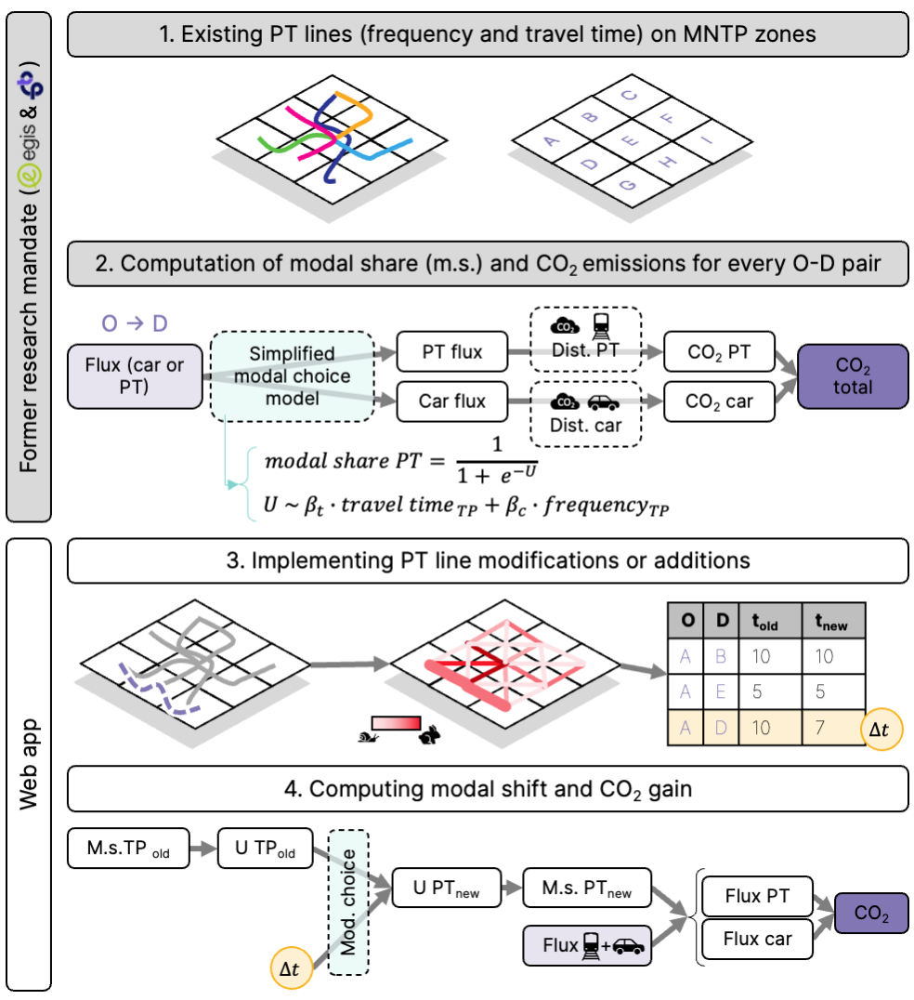

# TL CO₂ Impact Estimation Tool
> Disclaimer: I made this streamlit web app while working for [6t bureau de recherche](https://www.6-t.co) and cloned it to my personal account. This tool is based on simplified assumptions and calibration results. It is meant to inform planning scenarios, not to serve as a prediction engine. Always interpret results with caution and consult additional evidence before making policy or investment decisions.
>

This web application was developed following a research mandate carried out by EGIS and 6t bureau de recherche. It allows users to simulate and evaluate the impact of modifications or extensions to public transport (PT) lines on CO₂ emissions within the Lausanne–Morges metropolitan area (PALM). The tool provides a quantified decision-support approach for comparing different PT scenarios using a calibrated modal shift model.

🌐 Live App: [tl-tool-co2.streamlit.app](tl-tool-co2.streamlit.app)

> ⚠ If you see a message like *“This app has gone to sleep due to inactivity”*, click *“Yes, get this app back up”*. If needed, go to *Manage app > Reboot app*.
> 

## Context

The modal shift model was calibrated using:

* MNTP (Modèle National de Transport de la Suisse): Integrating OD matrices and various behavioral transport datasets.
* MRMT (Mobility surveys conducted every 5 years): Used to correct specific inconsistencies, especially regarding bike usage.

Key takeaway from the mandate:

> Improving PT supply alone is insufficient to meet Lausanne’s Climate Plan objectives. Measures dissuading car use (e.g., reduced speed limits, longer parking search times) are also needed.
To make PT scenario evaluation more accessible, TL commissioned 6t to develop this web application.
>

## Methodology

### Conceptual Workflow
1. Transport lines (existing and new) are represented as network graphs linking MNTP zones.
2. Simplified logit utility functions evaluate the attractiveness of PT modes (travel time, frequency, etc.).
3. Changes to the PT network modify these utility functions.
4. Updated utilities yield new modal shares and corresponding CO₂ emissions using:
```
CO₂ Emissions = 
(Car users × Car distance × Car emission factor) 
+ (PT users × PT distance × PT emission factor)
```

| [](Flow.png) | 
|:--:| 
| *Figure 1: Visual conceptual workflow.<br>Click on the image to visualize the full size figure.* |

### Emission Factors (modifiable in app):

* Car: 0.11 kg CO₂/km
* PT: 0.01 kg CO₂/km

## Application Use

### a. Main Features
Simulate, modify, and analyze new PT lines and their CO₂ impact.

### b. Emission Parameters
Set the parameters before analyzing:

* Emission Type:
    * Direct (fuel combustion)
    * Indirect (infrastructure, energy production)
* Electrification Rate:
    * Cars: 18.2% (current) – 100%
    * Public transport: 40% – 100%

### c. Adding PT Lines
Two methods:

1. Manual Drawing
    * Draw one or more lines on the map.
    * Enter:
        * Duration (min)
        * Frequency (trips/day)

2. File Upload
    * Supports:
        * .gpkg (GeoPackage)
        * .zip (Shapefile bundle)
    * Select the corresponding columns:
        * Duration (e.g., duree)
        * Frequency (e.g., frequence)
        * Line name (e.g., nom)

3. Modify Existing Lines
After a line is added:
    * Adjust its duration or frequency via the sidebar.

### d. Line Selection
Choose which added/imported lines to include in the analysis. Selected lines are displayed on a separate map.

### e. Run Analysis
Click *"Lancer l'analyse"* to compute:

* CO₂ emissions before/after changes
* Impacted OD pairs
* CO₂ savings from the modal shift

### f. Result Outputs
The tool provides:
* CO₂ (t/day) before/after for impacted trips
* Estimated CO₂ reduction (t/day)
* Equivalent car trips shifted to PT (per day)
> ⚠ Does not represent new users on the proposed line\
Hypothesis: the average person living in the PALM emits 3 kg CO2 per day with car trips. By dividing the CO2 reduction by 3 kg per person per day, we obtain the equivalent loss in number of cars.
>
* Average car distance replaced by PT (km)

| [](Usage_example.png) | 
|:--:| 
| *Figure 2: Example of the webapp with two lines called A and B loaded from a shapefile zip.<br>Click on the image to visualize the full size figure.* |

## Limitations

* Only scenarios affecting at least two MNTP zones can be analyzed.
* Results show aggregate effects, not individual line performance.
* Some MNTP zone behaviors may differ from real-world expectations.
* The goal is to support trend analysis — not precise forecasting.

## Project Structure
```
.
├── app.py                  # Streamlit application
├── data/
│   ├── GenerateNetwork_app.py # CO₂ & modal analysis logic
│   └── input_files/       # Upload examples or templates
├── requirements.txt       # Python dependencies
├── README.md              # This file
```

## Installation (Developer Mode)

Prerequisites
* Python 3.8 or higher
* Dependencies listed in `requirements.txt`
```
git clone https://github.com/Fien6-t/TL-Outil-CO2.git
cd tl-co2-tool
pip install -r requirements.txt
streamlit run app.py
```

## Key Libraries

* Streamlit – Web interface
* Geopandas – Geospatial data
* Folium – Interactive maps
* Shapely – Geometries
* Matplotlib – Color legends
